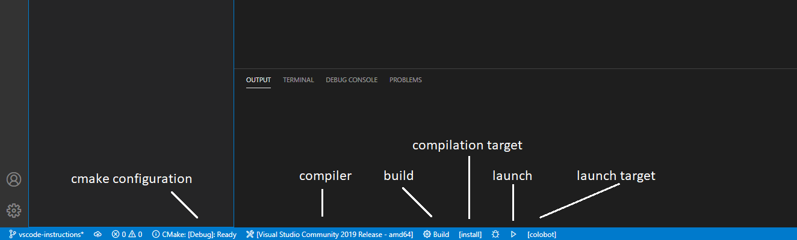

# Using Visual studio code to compile and install project

### Prerequisites

Before compilation you have to install tools and dependencies (points 1,2,3): [Installing tools and dependencies](https://github.com/colobot/colobot/wiki/How-to-Build-Colobot%3A-Gold-Edition-Using-MSVC#installing-tools-and-dependencies).

### Cloning project

In order to clone the project execute the following command:
```
git clone https://github.com/colobot/colobot.git
```
In order to clone the `data` submodule you also have to execute: **(this module is needed to launch the game)**
```
git submodule update --init
```
If you want you can combine this commands and execute:
```
git clone https://github.com/colobot/colobot.git --recurse-submodules
```
### Configuring vscode

1. Open project folder in vscode.
2. Install extension [CMake Tools](https://marketplace.visualstudio.com/items?itemName=ms-vscode.cmake-tools).
3. Install extension [C/C++](https://marketplace.visualstudio.com/items?itemName=ms-vscode.cpptools).
4. On the status line at the bottom you can choose cmake configuration and compiler (for reference see the image at the bottom).

### Adding cmake settings:

Create folder .vscode if there is none. Inside that folder create a file settings.json with the following content:
```json
{
    "cmake.configureSettings": {
            "name": "x64-Debug",
            "generator": "Ninja",
            "configurationType": "Debug",
            "inheritEnvironments": ["msvc_x64_x64"],
            "CMAKE_TOOLCHAIN_FILE": "input your path to the toolchain file",
            "VCPKG_TARGET_TRIPLET": "x64-windows-static",
            "GLEW_STATIC": "1",
            "MSVC_STATIC": "1"
        },
    "cmake.buildDirectory": "${workspaceFolder}\\out\\build\\x64-Debug",
    "cmake.installPrefix": "${workspaceFolder}\\out\\build\\x64-Debug",
    "cmake.generator": "ninja"
}
```

### Compilation and installation

1. Open cmake extension in the left menu and click on `build all projects`

    
2. On the status line at the bottom change the compilation target to `install`.
3. Click `build` to build the project.
4. After the project is built, click on `launch` to run a game.

    


If you have any problems create an issue or talk to us on our [Discord channel](https://discord.gg/56Fm9kb).
